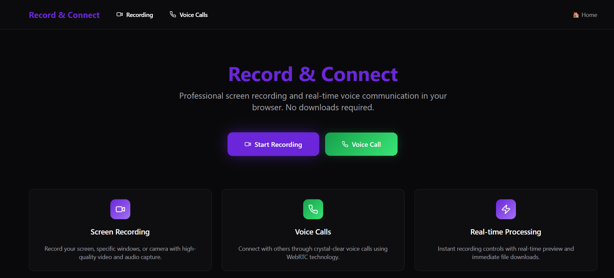

# 🖥️ Record and Connect

A web-based screen recording application with integrated audio call functionality. Capture your screen and microphone, preview your recordings, and seamlessly initiate audio calls—all in one intuitive interface.

## 🌐 Live Preview

👉 [Click here to open the live app](https://record-and-connect.vercel.app/)

  
*Recording interface preview*

---

## 🚀 Features

- 🎥 **Screen Recording**: Record full screen, window, or tab with optional audio.
- 🎙️ **Microphone Support**: Choose and test mic input before recording.
- 🧩 **Pause / Resume / Stop** controls with real-time status.
- 🔊 **Audio Calling**: Peer-to-peer audio calls between users.
- 💾 **Preview & Download**: Review the recording and download as WebM.
- 🧠 **Smart UI**: Minimal, intuitive, responsive design.

## 🧰 Tech Stack

- **Frontend**: React + Vite (or Next.js if applicable)
- **Media APIs**: `getDisplayMedia()`, `MediaRecorder`, and WebRTC
- **Deployment**: Hosted on [Vercel](https://vercel.com/)

## 🎙️ Permissions & Fallbacks

* The app requests browser permissions to capture screen + microphone.
* If `getDisplayMedia()` is blocked (e.g. in an iframe), a simulated “demo mode” runs with mock UI & timers.

## 🧪 Testing

* Test mic audio before recording — you’ll see visualization feedback.
* Ensure pause/resume functionality persists recorded content correctly.
* Validate file download works across browsers and formats.

### 🔍 Tips & Notes

* Ensure browser compatibility for `getDisplayMedia()` and MediaRecorder.
* For audio calls, consider using a peer-to-peer solution like WebRTC (simplest) or third-party platforms (e.g., Twilio).
* Add session persistence (downloads, recordings, or call data) using IndexedDB or localStorage if needed.

---

## 👤 Author

**Pushpendra Kumar Shukla**
[Portfolio](https://pushpendrashukla19.github.io/pushpendrashukla/) · [LinkedIn](https://linkedin.com/in/pushpendrakumarshukla) · [GitHub](https://github.com/PushpendraShukla19)

